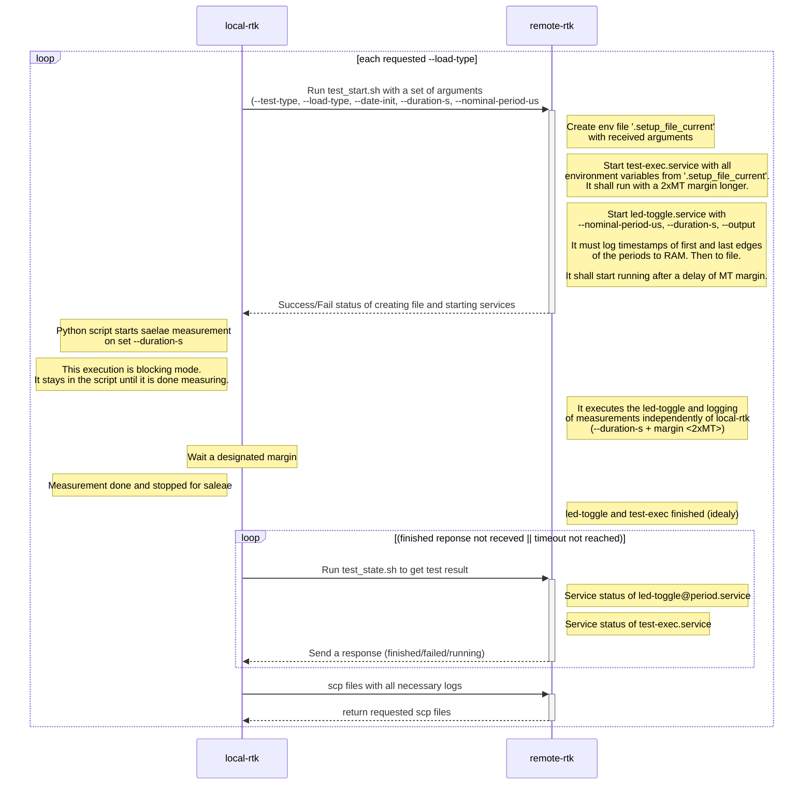
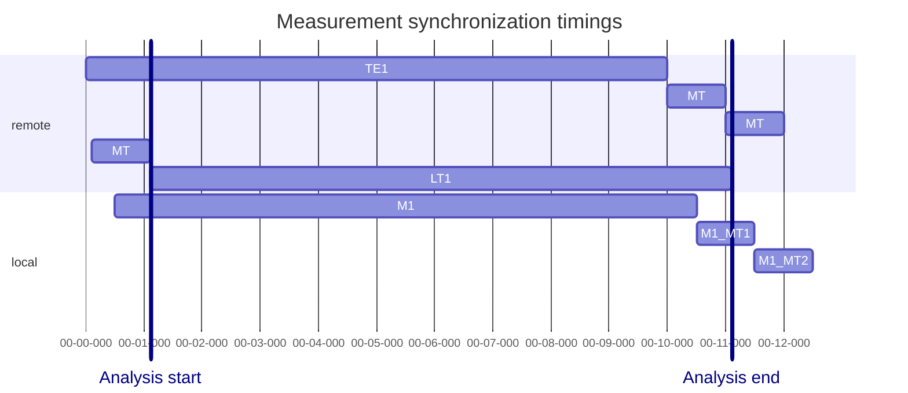

```mermaid
sequenceDiagram
    loop each requested --load-type
        local-rtk->>+remote-rtk: Run test_start.sh with a set of arguments<br>(--test-type, --load-type, --date-init, --duration-s, --nominal-period-us
        Note right of remote-rtk: Create env file '.setup_file_current'<br>with received arguments
        Note right of remote-rtk: Start test-exec.service with all<br>environment variables from '.setup_file_current'.<br>It shall run with a 2xMT margin longer.
        Note right of remote-rtk: Start led-toggle.service with<br>--nominal-period-us, --duration-s, --output<br><br>It must log timestamps of first and last edges<br>of the periods to RAM. Then to file.<br><br>It shall start running after a delay of MT margin.
        remote-rtk-->>-local-rtk: Success/Fail status of creating file and starting services
        Note left of local-rtk: Python script starts saelae measurement<br>on set --duration-s
        Note left of local-rtk: This execution is blocking mode.<br>It stays in the script until it is done measuring.
        Note right of remote-rtk: It executes the led-toggle and logging<br>of measurements independently of local-rtk<br>(--duration-s + margin <2xMT>)
        Note over local-rtk: Wait a designated margin
        Note left of local-rtk: Measurement done and stopped for saleae
        Note right of remote-rtk: led-toggle and test-exec finished (idealy)
        loop (finished reponse not receved || timeout not reached)
            local-rtk->>+remote-rtk: Run test_state.sh to get test result
            Note right of remote-rtk: Service status of led-toggle@period.service
            Note right of remote-rtk: Service status of test-exec.service
            remote-rtk-->>-local-rtk: Send a response (finished/failed/running)
        end
        local-rtk->>+remote-rtk: scp files with all necessary logs
        remote-rtk-->>-local-rtk: return requested scp files
    end
```

```mermaid
gantt
    title Measurement synchronization timings 
    %% This is a comment
    axisFormat %M-%S-%L
    dateFormat mm-ss-SSS
    %% mtx - stands for margine time,
    %%       where x is an iterator
    %% ry_mtx - remote margine time
    %% ly_mtx - local margine time
    section remote
        TE1 :rte1, 00-00-000, 10s
        MT  :rte_mt1, after rte1, 1s
        MT  :rte_mt2, after rte_mt1, 1s
        MT  :rlt_mt1, 00-00-100, 1s
        LT1 :rlt1, after rlt_mt1, 10s
    section local
        M1  :lm1, 00-00-500, 10s
        M1_MT1  :lm_mt1, after lm1, 1s
        M1_MT2  :after lm_mt1, 1s
    Analysis start   : vert, v1, after rlt_mt1, 1s
    Analysis end     : vert, v2, after rlt1, 1s
```
