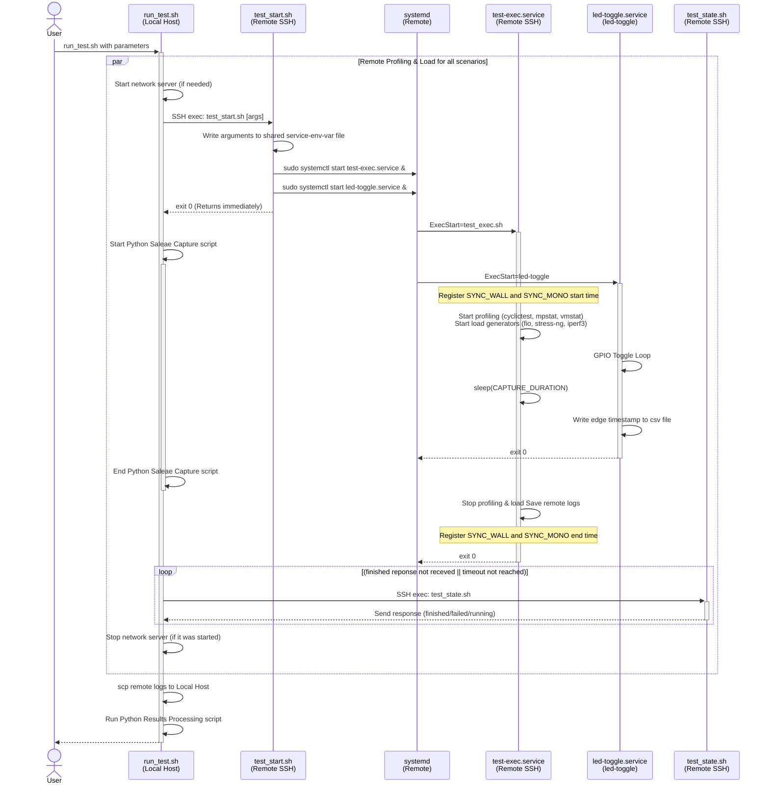
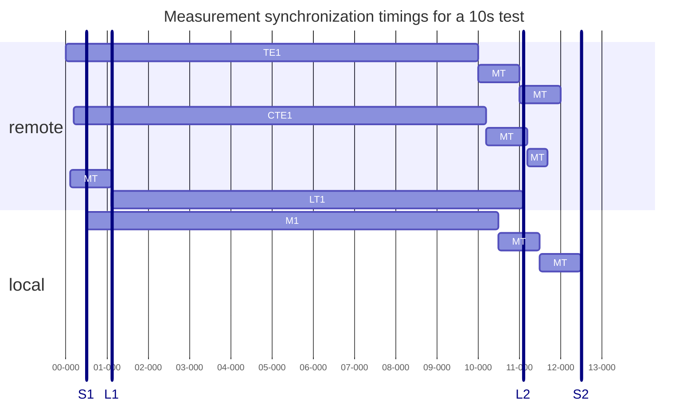
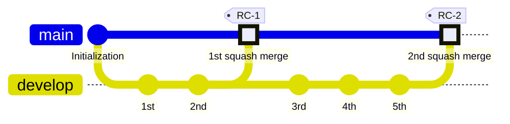

# rt-kernel
Real Time Linux kernel for Raspberry PI 3B+.

# Goal
The primary goals of this project are:
*   Compile a custom 64-bit Linux Kernel (v6.x) with the `PREEMPT_RT` patchset for the Raspberry Pi 3B+.
*   Isolate real-time operations to a single CPU core (the 3rd one).
*   Formally measure and reduce the Worst-Case Response Latency (WCRL). Based on literature measurements, WCRL is represented as the combined execution time of the initiating and responding tasks ($WCRL = WCET_{1} + WCET_{2}$).
*   Correlate internal OS measurements (using `cyclictest` WCET) with external hardware validation (using a Saleae logic analyzer) to prove determinism.
*   Improve upon existing benchmark literature. While prior studies show an oscilloscope-measured WCRL of ~50μs for an idle PREEMPT_RT kernel on Raspberry Pi, our target is to achieve and prove a highly optimized jitter bound of **~25μs** at idle and **~67μs** under full synthetic stress (CPU, Network, and USB loads).
*   Demonstrate latency reduction on the USB/Ethernet bus. High network or USB traffic can trigger a large number of Interrupt Requests (IRQs), which cause unpredictable latency spikes (jitter) in a standard kernel.
*   Add the new kernel to the Raspberry Pi to be able to switch between the default and the real-time one.

# Structure

The entire project is divided in 3 sections:
 * [kernel](./kernel/) - all the script required to get, configure, build and deploy a cross-compiled custom kernel
   * [.sshpass](./kernel/.sshpass) - target password for ssh operations
   * [configure.env](./kernel/config.env) - configure the desired options of what to enable/disable, kernel (baseline or RT) and patch version to build
   * [setup.sh](./kernel/setup.sh) - checking and setting up all software packages and downloading all necessary git repositories
   * [configure.sh](./kernel/configure.sh) - prepare and configure the kernel
   * [make.sh](./kernel/make.sh) - make/clean kernel source code and create the binaries (depending on your system resources this can take a while)
   * [install.sh](./kernel/install.sh) - it helps to deploy and configure the kernel on target system over SSH with possible argument options , a custom script for IRQ issolation, dual-boot configuration to CPU issolation/non-issolation and switching of the kernel via SSH
     * `kernel-deploy` - deploy new kernel set in configure.env to target and configure boot type (issolated or non-issolated CPU)
     * `kernel-boot-update` - update boot type of the kernel (issolated or non-issolated CPU)
     * `dual-boot-helpers` - deploy a bash script which automatically it will detect at boot how to issolate and assign the resources (IRQs)
     * `switch-kernel` - based on set options in configure.evn, it will update config.txt to boot the new kernel after restart (a keyboard input will be required to decide to which one to switch: d - default, b - baseline, r - RT patched)

 * [local-rtk](./local-rtk/) - it contains the scripts to initiate the tests on remote target
   * [processing](./local-rtk/processing/) - python scripts to process all measured data of logic analyzer and other linux specific files like mpstat, vmstat, pid, iperf3, fio, cyclictest, interrupts
   * [saleae](./local-rtk/saleae/) - script to trigger and capture automatically the measurements of logic analyzer saleae
   * [test_results](./local-rtk/test_results/) - test result folder will be created and hold all test results
   * [.env](./local-rtk/.env) - environment variables used by run_test.sh
   * [.env_setup](./local-rtk/.env_setup) - environement variables used by setup.sh
   * [.sshpass](./local-rtk/.sshpass) - target password for ssh operations
   * [requirements.txt](./local-rtk/requirements.txt) - python requirements
   * [setup.sh](./local-rtk/setup.sh) - checking and setting up all required software packages, python libraries and environment
   * [run_test.sh](./local-rtk/run_test.sh) - initiate test measurement with the following arguments
     * `--test-type <arg>` - for baseline use `default`, for RT patched one use `rt`
     * `--load-type <arg>` - indicate for which load types to execute the test; available ones are: `idle`, `load-cpu`, `load-net`, `load-usb`, `load-net-usb` and `load-full`
     * `--load-type-all` - execute testing with all available load types
     * `--nominal-period-us` - nominal toggle time period of the pins (SW and HW)
     * `--duration-s` - for how long to execute the test for each individual load type
     * `--relative-toggle-time` - by default all test are using an absolute toggle time for the pins, if this options is used, it will switch to a relative toggle time mechanism which will give worse results

 * [remote-rtk](./remote-rtk/) - this folder needs to be deployed on the target which will be tested; local-rtk will trigger start of testing from this folder which needs to be located in your user's home folder
   * [led-toggle](./remote-rtk/led-toggle/) - pins toggle software logic
     * [build.sh](./remote-rtk/led-toggle/build.sh) - use this to build the software first; give `make` or `clean` argument to the script
     * [CMakeLists.txt](./remote-rtk/led-toggle/CMakeLists.txt) - cmake file to build assembly the build
     * [led-toggle.c](./remote-rtk/led-toggle/led-toggle.c) - logic of pin toggle (SW and HW) and saving first and last periods to a csv file for measurment alignment with obtained tool results
   * [test-exec](./remote-rtk/test-exec/) - this folder cointans the handlers of entire testing
     * [.env](./remote-rtk/test-exec/.env) - environment file used by test-exec scripts
     * [test_exec.sh](./remote-rtk/test-exec/test_exec.sh) - it executes the test which is handled by test-exec.service
     * [test_start.sh](./remote-rtk/test-exec/test_start.sh) - this file is the first one called by [run_test.sh](./local-rtk/run_test.sh) script, which it orchestrates the entire testing afterwards
     * [test_state.sh](./remote-rtk/test-exec/test_state.sh) - [local-rtk](./local-rtk/) will check if previously initiated testing finished and it is safe to start a new one
   * [setup.sh](./remote-rtk/setup.sh) - checking and setting up all required software packages, led-toggle and test-exec services
   * [.env_setup](./remote-rtk/.env_setup) - environement variables used by setup.sh

# Documentation

All related documentation to RPI 3B+ is taken directly from the official [source](https://www.raspberrypi.com/documentation/computers/raspberry-pi.html#introduction). A set of documents can be found in [Documents](./Documents/) folder and some provided links, like:
 * single-board computer (SBC) [BCM2837B0](https://www.raspberrypi.com/documentation/computers/processors.html#bcm2837b0)
 * [schematic](RP-008339-DS-1-raspberry-pi-3-b-plus-reduced-schematics.pdf)
 * [Results, Correlation, and Evaluation](./Documents/results_and_evaluation.md) - Contains the literature comparison (WCRL/WCET) and the empirical latency findings.

For pinout mapping, use [pinout.xyz](https://pinout.xyz/)

# Setup

This guide details the cross-compilation process on a host Linux machine to build the kernel for the Raspberry Pi 3B+.

The setup is made on the latest available [Raspberry Pi Os Lite](https://www.raspberrypi.com/software/operating-systems/) of:
 * __Release date:__ 12 May 2026
 * __System:__ 64-bit
 * __Kernel Version:__ 6.12.29+rpt-rpi-v8
 * __Debian version:__ 13 (trixie)

The goal is to add an additional kernel to be able to switch between them.

The pin is toggle by a small code made in C. Check [SDK Setup](https://www.raspberrypi.com/documentation/microcontrollers/c_sdk.html#sdk-setup) and the examples to setup and compile a C project.

### 1. Prerequisites

Check and make sure that:
 * you have a stable SSH connecton with the possibility to login to the machine
 * [remote-rtk](./remote-rtk/) is downloaded to your target machine
 * setup.sh did configure the services, installed required packages and led-toggle is build from [remote-rtk](./remote-rtk/)
 * make sure to run setup.sh from [remote-rtk](./remote-rtk/) before running the actual test with run_test.sh
 * in case of a need of custom kernel, make sure to run it in the following order:
  * `config.env` setup
  * `setup.sh` to download and set required kernel and patches
  * `configure.sh` to configure RT/baseline or other configuration options
  * `make.sh` to build the new kernel
  * `install.sh` to deploy it 

### 2. Get Kernel and RT Patch

If your goal is to use a kernel earlier of 6.12, you'll need to find RT patches by yourself. Check this [link](https://mirrors.edge.kernel.org/pub/linux/kernel/projects/rt) to understand which RT patches and kernel versions you can use.

In case you'd like to use the latest kernel from Raspberry Pi foundation, make sure that your cross-checking with their [documentation](https://www.raspberrypi.com/documentation/computers/linux_kernel.html) and [github](https://github.com/raspberrypi/linux).

Check [kernel](./kernel/) and [Structure](#structure) paragraph on how to setup the desired kernel build.

_Note: In case the a custom patch is used, you must be aware the the kernel will, most likely, build from the upstream which means that the drivers and optimization made by Raspberry Pi foundation may be missing. A more complex handling of the configuration may be handled in this case._

# Testing

The entire testing orchestration is making sure that meassurement and initiating software (iperf3, fio etc.) happens a bit earlier in such a way that pin toggle stress will happen after all stressors are active.

The measurments and testing x axis are synchronized in the following way:
 * test-exec.log contains
   * `SYNC_WALL` - clock time in `%Y-%m-%d-%H:%M:%S.%N` format
   * `SYNC_MONO` - CLOCK_MONOTONIC value of `/proc/uptime`
 * led_toggle_edges.csv contains CLOCK_MONOTONIC saved by led-toggle.service of start and end periods.
 * digital.csv holds time of the occured edges in iso8601 timestamp format

 `SYNC_WALL` and `SYNC_MONO` is used to adjust x axis of all the measurements to `L1` and `L2` time frame. Check [timing diagram](#timing-diagram).

## Sequence diagram

## Timing diagram

The goal is to follow and achive a testing scenario which will cover this timings, where:
 * `remote` section represents the timings on the remote side of the target
   * `TE1` is test-exec service which runs the test at the moment
   * `CTE1` are the commands which are running in the current test, like: iperf3, fio, mpstat, vmstat, cat of /proc/interrupts; almost all of them start at the same time
 * `local` section contains the components which are triggered on the local side
   * `LT1` is the server of pins toggle (SW and HW)
   * `M1` is the meassurement of pins toggle with saleae logic analyzer
 * `MT` is a small margine time required to synch the testing; bigger block is 1s while the smaller block is 0.5s.
 * `S1` and `S2` - is the vertical timestamp line which indicates the timeframe when saleae is measuring the pins toggle
 * `L1` and `L2` - is the time interval where the led-toggle service is toggling the pins on the target

## Git development strategy

Git branching strategy is made out of 2 branches: `main` and `develop`. On main, commits are squash merged from develop, having only stable functional commits. On develop - the actual feature implementation.

